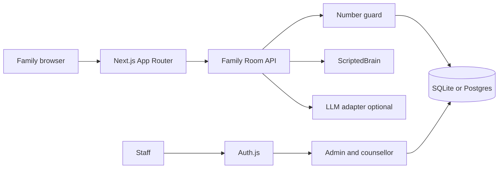
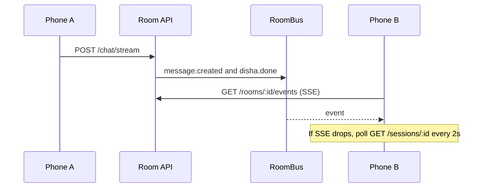
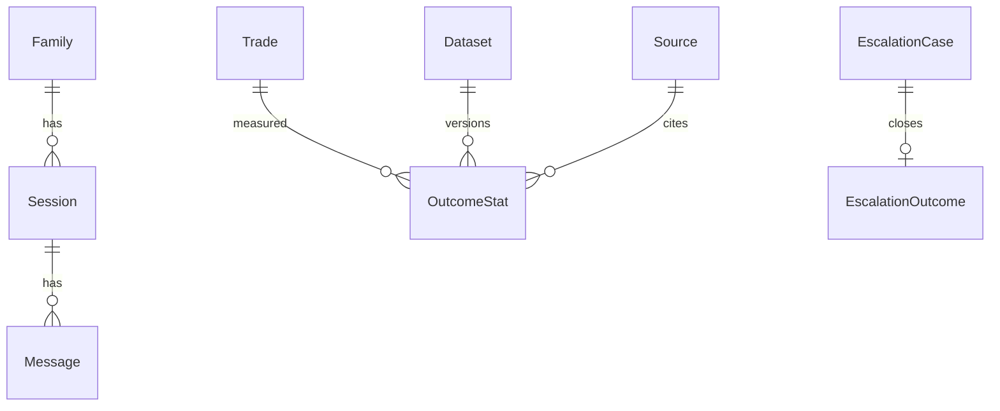

# Architecture

Numbers shown to a family are loaded from OutcomeStat rows, passed through slot tokens, and checked again for stray digits. The model is not allowed to invent a figure.

The bus is in-process. A second instance does not share memory, so the client falls back to polling message rows.

