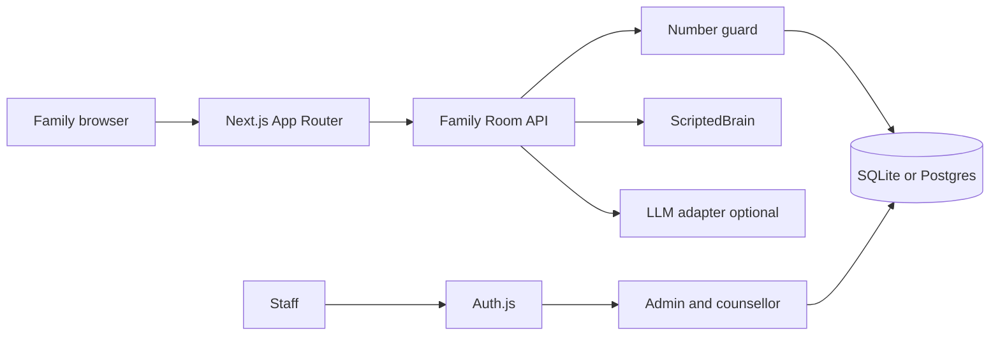
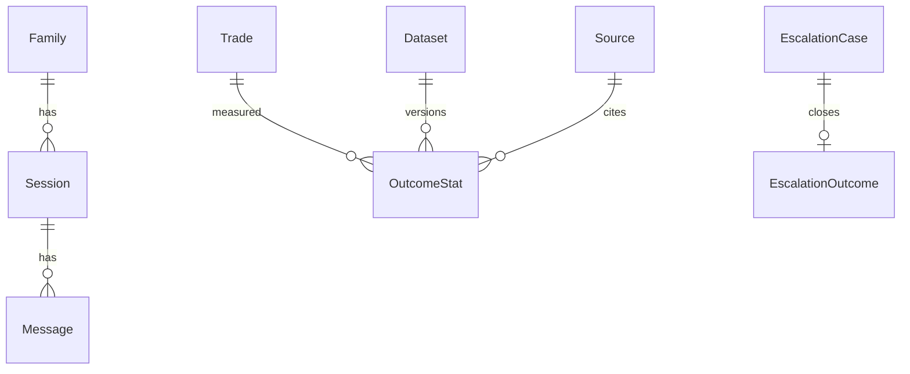

# Architecture

```mermaid
flowchart LR
  family[Family browser] --> app[Next.js App Router]
  app --> room[Family Room API]
  room --> guard[Number guard]
  guard --> db[(SQLite or Postgres)]
  room --> scripted[ScriptedBrain]
  room --> llm[LLM adapter optional]
  staff[Staff] --> auth[Auth.js]
  auth --> admin[Admin and counsellor]
  admin --> db
```

Numbers shown to a family are loaded from OutcomeStat rows, passed through slot tokens, and checked again for stray digits. The model is not allowed to invent a figure.

```mermaid
erDiagram
  Family ||--o{ Session : has
  Session ||--o{ Message : has
  Trade ||--o{ OutcomeStat : measured
  Dataset ||--o{ OutcomeStat : versions
  Source ||--o{ OutcomeStat : cites
  EscalationCase ||--o| EscalationOutcome : closes
```
